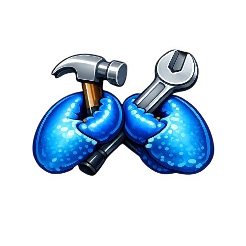

<p align="center">
  
</p>

<h1 align="center">ZeroBuild 🛠️</h1>

<p align="center">
  <strong>The autonomous build engine. Zero setup. Zero friction. 100% Rust.</strong><br>
  ⚡️ <strong>From thought to software — web apps, mobile, backends, scripts, and more. Sandboxed, secure, deploy-ready.</strong>
</p>

<p align="center">
  <a href="LICENSE-APACHE"></a>
  <a href="NOTICE"></a>
  <a href="https://t.me/zerobuild_bot"></a>
</p>

<p align="center">
Built on <a href="https://github.com/zeroclaw-labs/zeroclaw">ZeroClaw</a> — the Rust-first autonomous agent runtime.
</p>

<p align="center">
  <a href="#quick-start">Quick Start</a> |
  <a href="bootstrap.sh">One-Click Setup</a> |
  <a href="docs/commands-reference.md">Commands</a> |
  <a href="docs/setup-guide.md">Setup Guide</a>
</p>

<p align="center">
  <strong>Describe what you want to build. Confirm the plan. Watch it come to life.</strong><br />
  ZeroBuild handles scaffolding, coding, building, and deploying — all in isolated sandboxes.
</p>

<p align="center"><code>Autonomous builds · Multi-channel · Isolated sandboxes · GitHub connector · Model-agnostic</code></p>

---

## ✨ What is ZeroBuild?

ZeroBuild is **the autonomous build engine** that turns your ideas into working software. Describe what you want in natural language, confirm the plan, and ZeroBuild scaffolds, codes, builds, and ships it — all inside isolated sandboxes.

**What you can build:**
- 🌐 **Web applications** — Next.js, React, Vue, static sites
- 📱 **Mobile apps** — React Native, Flutter, Ionic  
- ⚙️ **Backend services** — APIs, microservices, serverless functions
- 🛠️ **CLI tools & scripts** — Python, Node.js, Rust utilities
- 🎮 **Games & interactive apps** — WebGL, Canvas, game prototypes
- 🤖 **Automation & bots** — Scrapers, workflows, integrations
- And anything else you can describe...

**Key capabilities:**

- 🏗️ **Plan-before-build workflow** — Agent proposes a structured plan; you confirm before any code is written
- 🔒 **Isolated sandboxes** — Every build runs in an E2B MicroVM or Docker container; your host stays untouched
- 🌐 **Live preview URLs** — Get public HTTPS links to running web apps
- 🚀 **GitHub connector** — Connect your GitHub account via OAuth to create repos, push code, open issues, and manage PRs — all from chat
- 🧠 **Intelligent model routing** — Automatic model recommendations based on task type
- 💬 **Multi-channel support** — Use Telegram, Discord, Slack, or CLI — your choice

---

## 🚀 Quick Start

```bash
# 1. Clone and bootstrap
git clone https://github.com/potlock/zerobuild.git
cd zerobuild
./bootstrap.sh

# 2. Build the release binary
cargo build --release

# 3. Onboard with your API keys
./target/release/zerobuild onboard --interactive

# 4. Start the gateway
./target/release/zerobuild gateway
```

Then message your bot: *"Build me a REST API for a todo app"* or *"Create a mobile app for tracking expenses"*

See the full [Setup Guide](docs/setup-guide.md) for detailed instructions.

---

## 🏗️ Architecture

```
User (Telegram / Discord / Slack / CLI)
    │
    ▼
ZeroBuild Runtime (Rust)          ← Unified Agent
  • Receives messages from any channel
  • Plans builds with user confirmation
  • Runs code in E2B/Docker sandboxes
  • Integrates with GitHub via OAuth (create repos, issues, PRs, push code)
    │
    ▼
Sandbox (E2B MicroVM or Docker)   ← Isolated Build Environment
  • Ubuntu Linux with your chosen runtime
  • Scaffolds projects, installs dependencies
  • Runs dev servers with public preview URLs
```

**Universal Agent Design:** ZeroBuild uses a single-tier architecture. The same agent handles conversation, planning, coding, and deployment — no backend proxy. Sandbox tools are always available; the agent uses them when you ask to build something, regardless of channel.

---

## 🛠️ Build Workflow

1. **Describe** — Tell the agent what you want to build (web app, mobile app, API, etc.)
2. **Plan** — Agent proposes tech stack, architecture, and components
3. **Confirm** — You approve the plan (or request changes)
4. **Build** — Agent scaffolds and codes in a sandbox
5. **Preview** — For web apps: live URL generated instantly
6. **Iterate** — Request changes; agent edits and rebuilds
7. **Connectors (GitHub, etc.)** — Create repos, push code, open issues, or manage PRs — all from chat

---

## 🌟 Features

| Feature | Description |
|---------|-------------|
| **Build Engine** | Build web, mobile, backend, CLI tools, scripts — anything you can describe |
| **Multi-Channel** | Telegram, Discord, Slack, Matrix, or CLI — use what you prefer |
| **Sandbox Provider Choice** | E2B cloud sandboxes (default) or local Docker containers |
| **Model Advisor** | Recommends optimal models per task (Sonnet 4.5 for code, Kimi for long context, etc.) |
| **Session Persistence** | SQLite snapshots save project state; resume builds across sessions |
| **Multi-Provider LLM** | OpenAI, Anthropic, OpenRouter, DeepSeek, Gemini, and more |
| **Secure by Default** | OAuth tokens stored in SQLite only; never in logs or messages |
| **Connectors (GitHub)** | Create issues, PRs, reviews, and push code — all via chat |

---

## 📊 ZeroBuild vs Alternatives

| | ZeroBuild | Bolt.new | Lovable | V0 | OpenClaw |
|---|:---:|:---:|:---:|:---:|:---:|
| **What you can build** | Anything | Web only | Web only | Web only | Anything |
| **Interface** | Any channel | Web | Web | Web | CLI only |
| **Sandbox** | E2B/Docker | StackBlitz | Own cloud | Vercel | Docker |
| **Open Source** | ✅ Yes | ❌ No | ❌ No | ❌ No | ✅ Yes |
| **Self-Hostable** | ✅ Yes | ❌ No | ❌ No | ❌ No | ✅ Yes |
| **Runtime** | Rust (<10MB) | Cloud | Cloud | Cloud | Node.js |
| **Connectors (GitHub)** | ✅ Full (repos, issues, PRs, push) | ❌ No | ❌ No | ❌ No | Manual |

---

## 🙏 Credits

ZeroBuild is built on top of **[ZeroClaw](https://github.com/zeroclaw-labs/zeroclaw)** by zeroclaw-labs — the Rust-first autonomous agent runtime optimized for performance, security, and portability.

Special thanks to:
- **E2B** — For the incredible MicroVM sandbox infrastructure
- **ZeroClaw Labs** — For the lean, trait-driven agent runtime

---

## 📄 License

ZeroBuild is dual-licensed under:

| License | Use case |
|---|---|
| [MIT](LICENSE-MIT) | Open-source, research, academic, personal use |
| [Apache 2.0](LICENSE-APACHE) | Patent protection, institutional, commercial deployment |

You may choose either license.

---

## 🔗 Links

- [Setup Guide](docs/setup-guide.md) — Full installation and configuration
- [Commands Reference](docs/commands-reference.md) — CLI documentation
- [ZeroClaw](https://github.com/zeroclaw-labs/zeroclaw) — The runtime that powers ZeroBuild

---

**ZeroBuild** — Describe it. Confirm it. Build it. Push it. 🛠️
